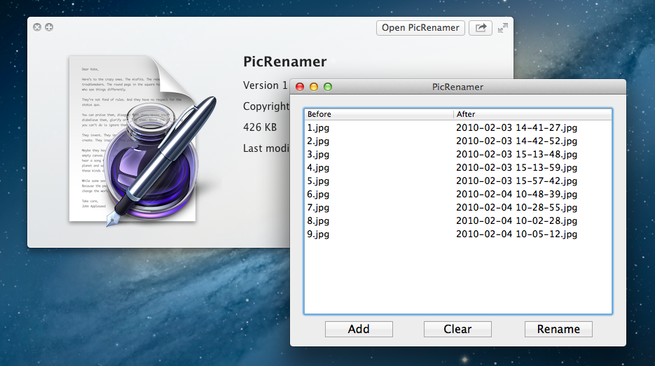

PicRenamer
==========
A Mac OS X application to help you rename your photos with their Exif date and time.

Version 1.0
-----------

* Rename your photos with their Exif date and time.

LICENSE
-------
The GPL License. Read [GNU General Public License](http://www.gnu.org/licenses/gpl.html) for further information.